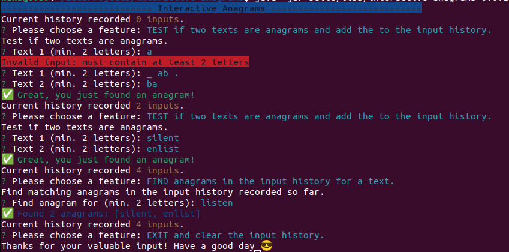

# Interactive Anagrams


Console application to test and find anagrams.


## Features

- Text-based UI
- Test if two entered texts are anagrams
- Record a history of text inputs during runtime
- Find matching anagrams within the history for an entered text

The implementation of these features can be used to demonstrate basic Java development skills.
## Installation
There are two ways to install the executable Java archive (Fat JAR), either download or build from the sources. 

(a) Install by downloading the released JAR file, e.g. by using `wget` or the `curl` command.

```bash
  curl -o https://github.com/hans4dev/interactive-anagrams/releases/latest/interactive-anagrams-<version>.jar
```
Where `<version>` needs to be replaced with the current version, like `0.0.1`.
 

(b) Install by cloning the repository and building from the sources. Use Gradle tasks `build` and `fatJar` for packaging.

```bash
  git clone git@github.com:hans4dev/interactive-anagrams.git
  cd interactive-anagrams
  ./gradlew build fatJar
```

### Prerequisites and Dependencies
The prerequisites to install and run the application are:

* a terminal, preferably with ANSI color support
* Java 8+ to build and execute 
* Git client to clone the repository

Other languages, tools and libraries used:

* [Gradle](https://gradle.org/) - build tool (in the Groovy syntax) to build and package.
* [Spock](https://spockframework.org/) - specification and testing framework (also Groovy) for implementing tests with readable specifications (in BDD style).
* [ConsoleUI](https://github.com/awegmann/consoleui) - library for simple UI elements on ANSI console based terminals, by Andreas Wegmann.

## Run Locally

Clone the project.

```bash
  git clone git@github.com:hans4dev/interactive-anagrams.git
```

Go to the project directory.

```bash
  cd interactive-anagrams
```

Install dependencies and build the (Fat) JAR by executing the Gradle tasks `build` followed by `fatJar`.

```bash
  ./gradlew build fatJar
```

Start the console-application directly from the JAR in your favourite terminal, optionally with ANSI color support. Therefor use the `-jar` option of the `java` command. 

```bash
  java -jar interactive-anagrams-<version>.jar
```
Where `<version>` needs to be replaced with the current version, like `0.0.1`.

## Running Tests

The unit-tests are written in Spock.
To run tests, execute the Gradle task `test`.

```bash
  ./gradlew test
```


## Demo




## Documentation

For additional insights to research, design and decisions made, please consult the separate [Documentation](docs).